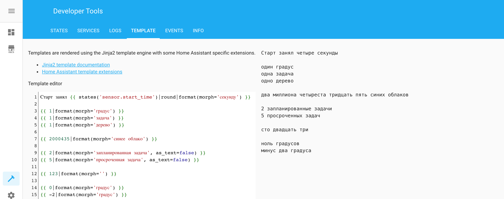

# Morph Numbers для Home Assistant

[](https://github.com/custom-components/hacs)

Компонент [Home Assistant](https://www.home-assistant.io/), добавляющий **Jinja2** фильтр для работы с числительными. Хорошо подходит в дополнение к моему второму компоненту [YandexStation](https://github.com/AlexxIT/YandexStation).



## Установка

**Способ 1.** [HACS](https://hacs.xyz/)

> HACS > Интеграции > 3 точки (правый верхний угол) > Пользовательские репозитории > URL: `AlexxIT/MorphNumbers`, Категория: Интеграция > Добавить > подождать > MorphNumbers > Установить

**Способ 2.** Вручную скопируйте папку `morph_numbers` из [latest release](https://github.com/AlexxIT/MorphNumbers/releases/latest) в директорию `/config/custom_components`.

## Настройка

**Способ 1.** GUI

> Настройки > Интеграции > Добавить интеграцию > **MorphNumbers**

Если интеграции нет в списке - очистите кэш браузера.

**Способ 2.** YAML

```yaml
morph_numbers:
```

## Использование

Используется как дополнительный фильтр в шаблонах.

### Согласование слов с числительными

Полезно при отправке в Телеграм

```jinja2
{{ 24|format(morph='градус', as_text=false) }} => 24 градуса
```

### Преобразование чисел в текст

Полезно для TTS. Яндекс и Google допускают ошибки при произнесении числительных.

```jinja2
{{ 2|format(morph='просроченная задача') }} => две просроченные задачи
```

### Прочее

```jinja2
{{ 2000435|format(morph='') }} => два миллиона четыреста тридцать пять
```

### Шаблон из скриншота

```yaml
Старт занял {{ states('sensor.start_time')|round|format(morph='секунду') }}

{{ 1|format(morph='градус') }}
{{ 1|format(morph='задача') }}
{{ 1|format(morph='дерево') }}

{{ 2000435|format(morph='синее облако') }}

{{ 2|format(morph='запланированная задача', as_text=false) }}
{{ 5|format(morph='просроченная задача', as_text=false) }}

{{ 123|format(morph='') }}

{{ 0|format(morph='градус') }}
{{ -2|format(morph='градус') }}
```

```yaml
script:
  morph_numbers_test:
    sequence:
    - service: persistent_notification.create
      data_template:
        message: Старт занял {{ states('sensor.start_time')|round|format(morph='секунду') }}
```